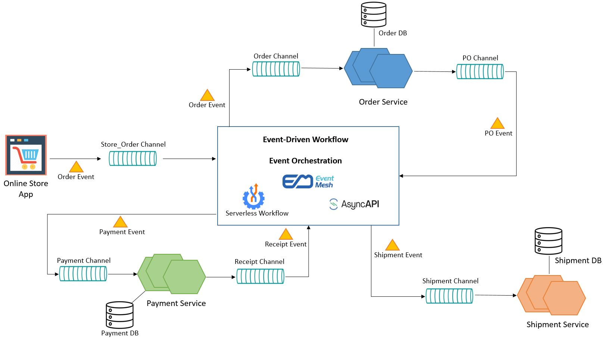

# Serverless Workflow Automation Platform
# Serverless Workflow Automation Platform

## Overview
A fully serverless platform to automate workflows using AWS Lambda, API Gateway, and DynamoDB.

## Features
- User registration
- Workflow creation
- Trigger workflows manually
- View workflow logs
- Frontend dashboard (React)
- Monitoring with CloudWatch

## Tech Stack
- AWS Lambda
- API Gateway
- DynamoDB
- CloudWatch
- React (Frontend)
- AWS SAM (Deployment)

## Deployment Instructions
1. Clone repository
2. Install frontend dependencies:
   ```bash
   cd frontend-app
   npm install
   npm start
- Deployed locally using AWS SAM; full-stack serverless workflow platform with AWS Lambda, API Gateway, DynamoDB, and React frontend.

##Here’s a concise, professional way to describe your **screenshots** in your `README.md`:

---

### **Screenshots**

1. **Home Dashboard** – Overview of the platform and navigation.
2. **Workflow Creation** – Form to create a new automation workflow.
3. **Trigger Workflow** – Manual workflow execution interface.
4. **Logs Page** – View workflow execution logs.
5. **CloudWatch Monitoring** – Lambda logs and metrics overview.
6. **Frontend & Backend Integration** – Interaction between React frontend and AWS Lambda via API Gateway.

You can reference them in your README like this (Markdown):

```markdown



```


